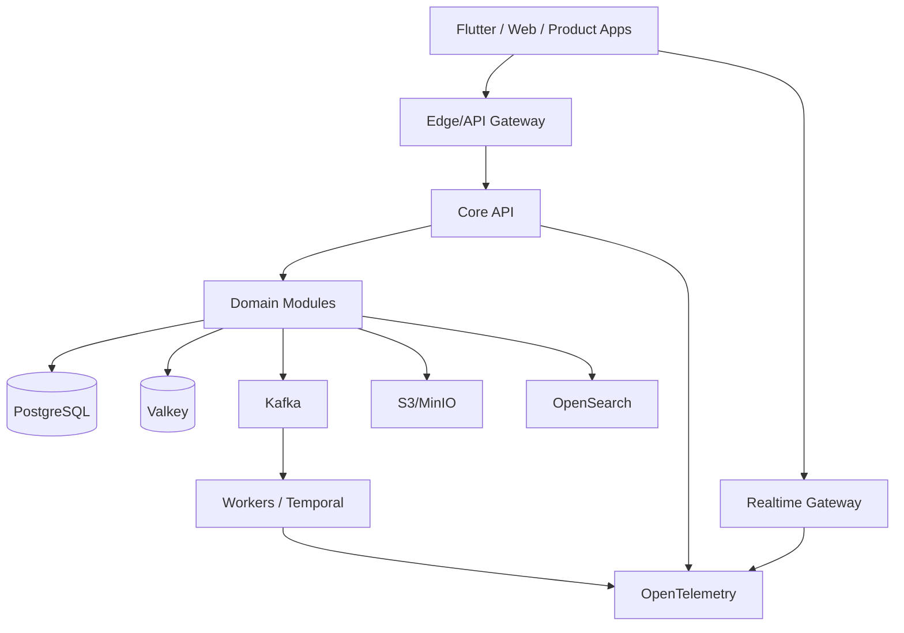

# Architecture Overview

## Principles

1. Git is the source of truth.
2. Core is product-agnostic.
3. Domain APIs hide storage vendors and physical schemas.
4. Durable state, ephemeral state, search, objects and events use purpose-specific stores.
5. Every request/event carries a correlation ID.
6. Every breaking contract change is versioned.
7. AI-generated changes must arrive as reviewed pull requests.
8. Infrastructure changes are declarative.

## Runtime

