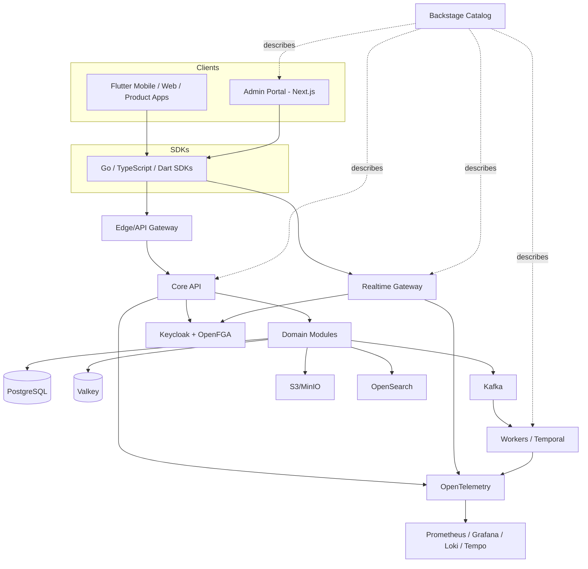

# Architecture Overview

## Principles

1. Git is the source of truth.
2. Core is product-agnostic.
3. Domain APIs hide storage vendors and physical schemas.
4. Durable state, ephemeral state, search, objects and events use purpose-specific stores.
5. Every request/event carries a correlation ID.
6. Every breaking contract change is versioned.
7. AI-generated changes must arrive as reviewed pull requests.
8. Infrastructure changes are declarative.
9. Consumers define interfaces, not providers - a module's `domain.go` declares what it needs, and both the real (`postgres/`) and fake (`memory/`) implementations satisfy that contract, never the reverse.
10. Real infrastructure only for validation - no phase in this repository has claimed success against a mock; see `docs/AI_CONTEXT.md`.
11. Backstage's catalog (`catalog/system.yaml`) is the live, machine-checked map of the platform - dependency and API/event claims are cross-checked against real source, not maintained as prose.
12. Products consume the platform through an official SDK (Go/TypeScript/Dart), never hand-rolled HTTP calls.

## Runtime

## Component map

| Layer | Real implementation |
|---|---|
| Backend services | `core-api` (domain modules), `realtime-gateway` (WebSocket/presence), `worker` (jobs, search indexing, Temporal workflows) |
| Client SDKs | `packages/go/coresdk`, `packages/typescript/core-sdk`, `packages/flutter/core_sdk` |
| Frontend apps | `apps/admin` (Next.js 15 App Router, the platform's own control-plane UI); `apps/mobile` (Flutter, SDK consumer) |
| Identity & access | Keycloak (authentication/JWTs), OpenFGA (fine-grained ReBAC) + Postgres-backed RBAC (`authz` module) |
| Durable/ephemeral/search/object/event stores | PostgreSQL, Valkey, OpenSearch, S3/MinIO, Kafka/Redpanda |
| Long-running processes | Temporal (workflows), `worker`'s job runner (immediate/scheduled/delayed/recurring/dead-letter) |
| Observability | OpenTelemetry (traces), Prometheus (`/metrics` on every service), Grafana (dashboards + provisioning), Loki (logs with `trace_id` correlation), Tempo (traces) |
| Developer portal / catalog | `platform/backstage`, backed by `catalog/system.yaml` - the real dependency graph and API/event registry |
| Control plane | `apps/admin`'s `/control-plane` page + `docs/control/platform.json` - one real, generated view of applications, versions, environment, dependencies, database ownership, events, contracts, health, alerts, and recent changes |

See `docs/AI_CONTEXT.md` for the module implementation pattern, the phase-by-phase build loop, and the non-negotiable rules; `VALIDATION.md` for the real, detailed record of what was built and live-validated in each of the 30 phases; and `docs/decisions/ADR-*.md` for the accepted architecture decisions this diagram assumes.
